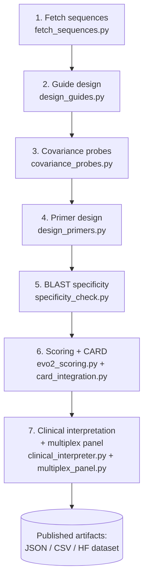

# Pipeline overview

!!! warning "Computational design phase"
    The pipeline described below is entirely **in silico**. No experimental
    validation has been performed. Outputs are research artifacts intended
    to inform downstream wet-lab work.

The SmartSepsis-Oph design pipeline has seven stages. Each stage is implemented
as a script at the repository root (migration to a packaged `src/` layout is
planned — see [Roadmap](../project/roadmap.md)).

## Flow

## Stages

### 1. Fetch sequences

Reference DNA sequences for the 12 resistance-gene families are pulled from
NCBI RefSeq via Entrez. Accessions are curated against AMRFinderPlus and CARD
ontology. See [data library](../data/library.md).

### 2. Guide design

CRISPR-Cas12a guide-RNAs scanning for the **TTTV PAM** across reference
targets, with on-target scoring and PAM-context filtering. See
[guide design](guide-design.md).

### 3. Covariance probes

Re-scoring of candidate guides with 18 biophysical features capturing
sequence context, structure, and predicted on-/off-target behavior. See
[scoring](scoring.md).

### 4. Primer design

Isothermal RPA primer pairs (37 °C operating point), tuned for
thermocycler-free, point-of-care workflows.

### 5. BLAST specificity

In silico specificity assessment against public reference repositories. A
planned stress-test pass against close non-target genomes will further probe
selectivity. See [specificity](specificity.md).

### 6. Scoring + CARD

Functional variant impact scoring (Evo 2 / EVEE inspired) plus enrichment
from the CARD database for drug class, resistance mechanism, and ontology.

### 7. Clinical interpretation + multiplex

Natural-language interpretation of designs and **multiplex panel
optimization** for downstream paper-strip assay architecture. See
[multiplex](multiplex.md).

## Companion modules

- **Structural analysis** (ESM-2, ProtT5, AlphaFold) feeds variant-level
  features into scoring and into the published dataset. See [structural
  analysis](structural.md).

## Reproducibility

See [Data → Reproducibility](../data/reproducibility.md) for the current
state of reproducibility documentation.
